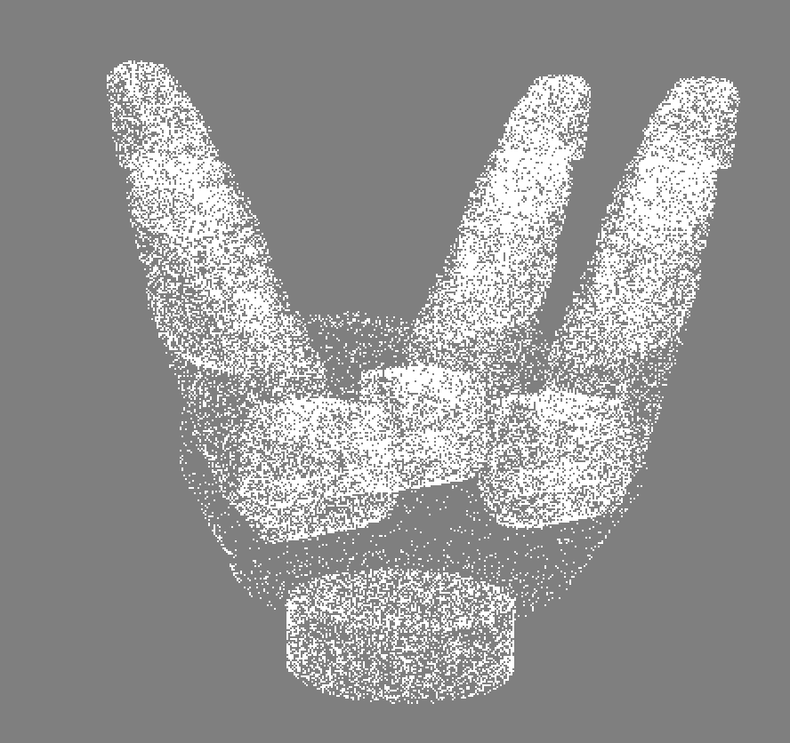

# A Python URDF Parser For Robotic Gripper in UniGrasp Project
UniGrasp: Learning a Unified Model to Grasp with Multifingered Robotic Hands
: https://sites.google.com/view/unigrasp

## Functions
1.Load and Visualize URDF of Robotic Hands.

2.Forward Kinematics 

3.Inverse Kienmatics

4.Sample Point Clouds




## Get Started
1.Initialize repository
```
git clone https://github.com/linsats/Python-Parser-for-Robotic-Gripper.git
```

2.Install requirement
```
conda create --name gripper --file requirements.txt
```

3.Activaet Conda
```
conda activate gripper
```

4.Run 
```
python gripper_files.py

```


If you think our work is useful, please consider citing use with
```
@ARTICLE{8972562,
author={L. {Shao} and F. {Ferreira} and M. {Jorda} and V. {Nambiar} and J. {Luo} and E. {Solowjow} and J. A. {Ojea} and O. {Khatib} and J. {Bohg}},
journal={IEEE Robotics and Automation Letters},
title={UniGrasp: Learning a Unified Model to Grasp With Multifingered Robotic Hands},
year={2020},
volume={5},
number={2},
pages={2286-2293},
doi={10.1109/LRA.2020.2969946},
ISSN={2377-3774},
month={April},}
```

